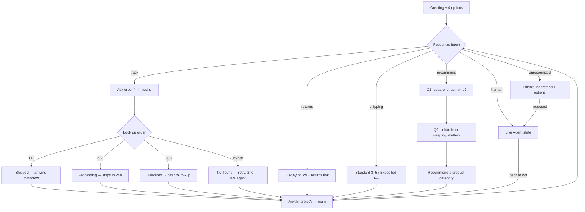

# Conversation Flow — North Star Support Bot

```mermaid
flowchart TD
  G["Greeting + 4 options"] --> R{"Recognize intent"}
  R -->|track| T["Ask order # if missing"]
  T --> L{"Look up order"}
  L -->|111| T1["Shipped — arriving tomorrow"]
  L -->|222| T2["Processing — ships in 24h"]
  L -->|333| T3["Delivered → offer follow-up"]
  L -->|invalid| T4["Not found → retry; 2nd → live agent"]
  R -->|returns| RET["30-day policy + returns link"]
  R -->|shipping| SH["Standard 3–5 / Expedited 1–2"]
  R -->|recommend| Q1["Q1: apparel or camping?"]
  Q1 --> Q2["Q2: cold/rain or sleeping/shelter?"]
  Q2 --> REC["Recommend a product category"]
  R -->|human| LA["Live Agent state"]
  R -->|unrecognized| FB["I didn't understand + options"]
  FB -->|repeated| LA
  T1 --> M["Anything else? → main"]
  T2 --> M
  T3 --> M
  T4 --> M
  RET --> M
  SH --> M
  REC --> M
  LA -->|back to bot| M
  M --> R
```

Every branch returns to the main menu (`M`), so the user is never stranded.
