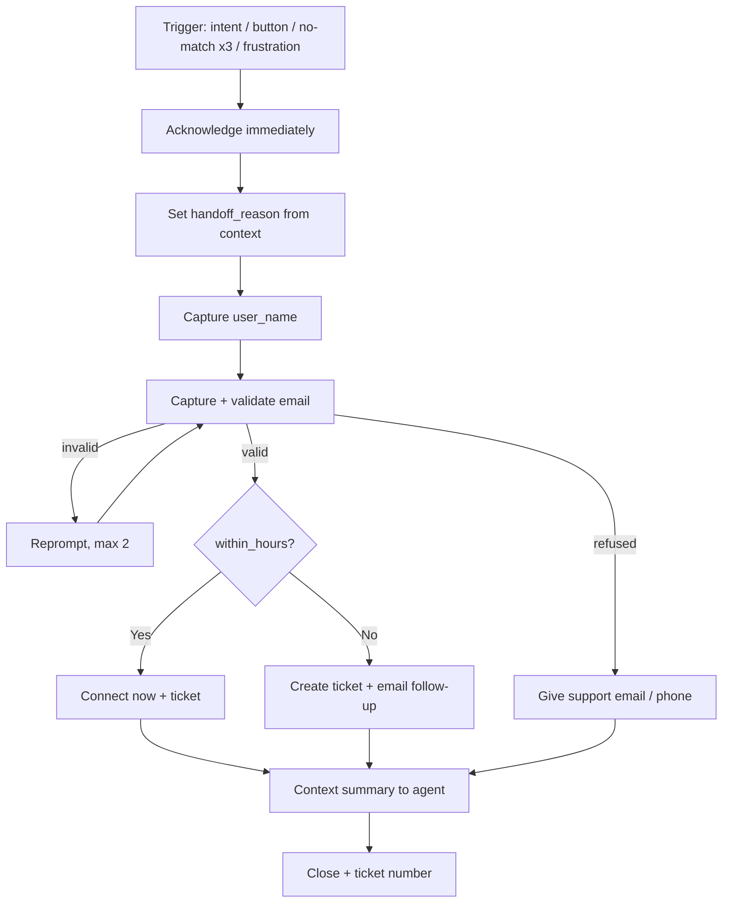

# Flow Diagram — Human Handoff

```mermaid
flowchart TD
  A["Trigger: intent / button / no-match x3 / frustration"] --> Ack["Acknowledge immediately"]
  Ack --> Ctx["Set handoff_reason from context"]
  Ctx --> Name["Capture user_name"]
  Name --> Email["Capture + validate email"]
  Email -->|invalid| Re["Reprompt, max 2"]
  Re --> Email
  Email -->|refused| Alt["Give support email / phone"]
  Email -->|valid| Hours{"within_hours?"}
  Hours -->|Yes| Live["Connect now + ticket"]
  Hours -->|No| Ticket["Create ticket + email follow-up"]
  Live --> Sum["Context summary to agent"]
  Ticket --> Sum
  Alt --> Sum
  Sum --> End["Close + ticket number"]
```

The handoff always passes a context summary (issue + order number) so the customer never has to
repeat themselves.
