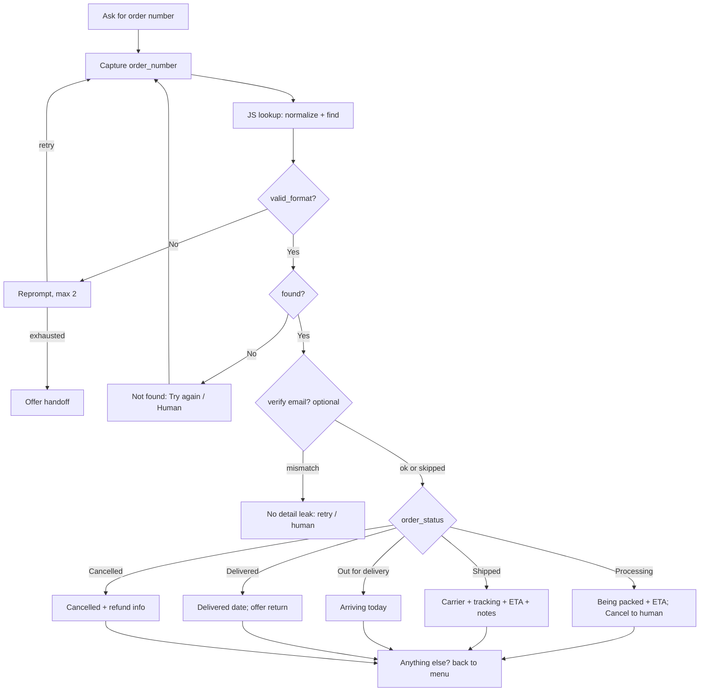

# Flow Diagram — Order Tracking

```mermaid
flowchart TD
  A["Ask for order number"] --> B["Capture order_number"]
  B --> C["JS lookup: normalize + find"]
  C --> D{"valid_format?"}
  D -->|No| E["Reprompt, max 2"]
  E -->|retry| B
  E -->|exhausted| H["Offer handoff"]
  D -->|Yes| F{"found?"}
  F -->|No| G["Not found: Try again / Human"]
  G --> B
  F -->|Yes| V{"verify email? optional"}
  V -->|mismatch| NoLeak["No detail leak: retry / human"]
  V -->|ok or skipped| S{"order_status"}
  S -->|Processing| P["Being packed + ETA; Cancel to human"]
  S -->|Shipped| Sh["Carrier + tracking + ETA + notes"]
  S -->|Out for delivery| O["Arriving today"]
  S -->|Delivered| Dl["Delivered date; offer return"]
  S -->|Cancelled| Cx["Cancelled + refund info"]
  P --> End["Anything else? back to menu"]
  Sh --> End
  O --> End
  Dl --> End
  Cx --> End
```

In-transit orders whose ETA has passed also get a "running a little behind" message with a
handoff option.
