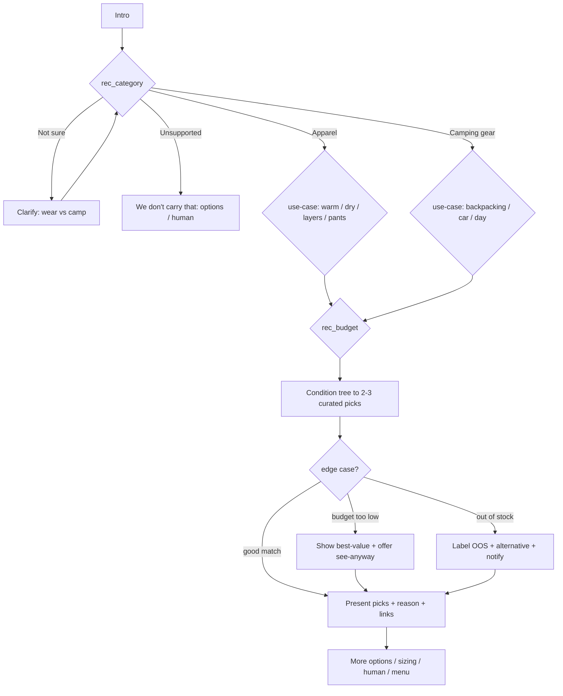

# Flow Diagram — Product Recommendations

Picks come from the curated mapping table in the conversation-design doc, sourced from
`products.json`. The optional Response AI step only phrases a rationale; it never invents specs.
