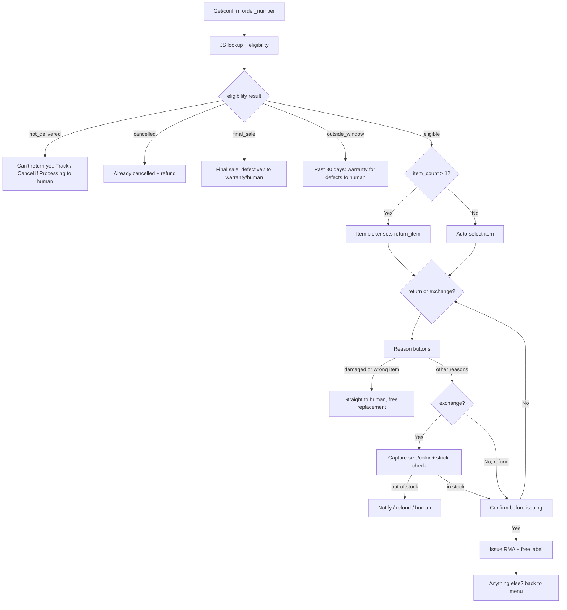

# Flow Diagram — Returns & Exchanges

```mermaid
flowchart TD
  A["Get/confirm order_number"] --> B["JS lookup + eligibility"]
  B --> C{"eligibility result"}
  C -->|not_delivered| ND["Can't return yet: Track / Cancel if Processing to human"]
  C -->|cancelled| CN["Already cancelled + refund"]
  C -->|final_sale| FS["Final sale: defective? to warranty/human"]
  C -->|outside_window| OW["Past 30 days: warranty for defects to human"]
  C -->|eligible| D{"item_count > 1?"}
  D -->|Yes| Pick["Item picker sets return_item"]
  D -->|No| Auto["Auto-select item"]
  Pick --> T{"return or exchange?"}
  Auto --> T
  T --> R["Reason buttons"]
  R -->|damaged or wrong item| Human["Straight to human, free replacement"]
  R -->|other reasons| Ex{"exchange?"}
  Ex -->|Yes| Size["Capture size/color + stock check"]
  Size -->|out of stock| OOS["Notify / refund / human"]
  Size -->|in stock| Conf
  Ex -->|No, refund| Conf["Confirm before issuing"]
  Conf -->|No| T
  Conf -->|Yes| RMA["Issue RMA + free label"]
  RMA --> End["Anything else? back to menu"]
```

Nothing is created until the explicit **Confirm** step, so misclicks and abandons are safe.
