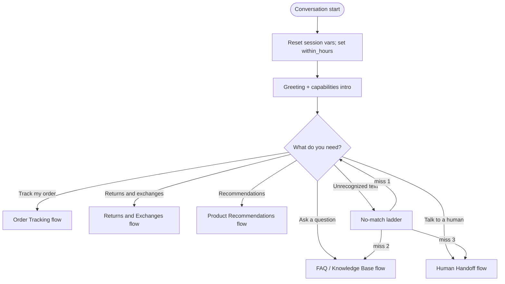

# Flow Diagram — Root / Welcome menu

```mermaid
flowchart TD
  Start(["Conversation start"]) --> Reset["Reset session vars; set within_hours"]
  Reset --> Welcome["Greeting + capabilities intro"]
  Welcome --> Menu{"What do you need?"}
  Menu -->|Track my order| Track["Order Tracking flow"]
  Menu -->|Returns and exchanges| Returns["Returns and Exchanges flow"]
  Menu -->|Recommendations| Rec["Product Recommendations flow"]
  Menu -->|Ask a question| FAQ["FAQ / Knowledge Base flow"]
  Menu -->|Talk to a human| Human["Human Handoff flow"]
  Menu -->|Unrecognized text| NoMatch["No-match ladder"]
  NoMatch -->|miss 1| Menu
  NoMatch -->|miss 2| FAQ
  NoMatch -->|miss 3| Human
```

Global intents `talk_to_human` and `main_menu` are reachable from any step.
